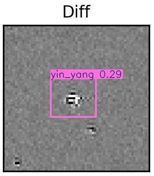

# Agentic AI for Autonomous Transient Classification

## Overview

This project presents an Agentic AI framework for autonomous real–bogus classification of astronomical transient events using Deep Learning, Computer Vision, Object Detection, Large Language Models (LLMs), and Multi-Agent AI architecture.

Modern astronomical sky surveys generate millions of transient alerts every night. However, nearly 90–95% of these alerts are bogus detections caused by:

- Noise
- CCD defects
- Satellite streaks
- Cosmic rays
- Image subtraction artifacts

Manual verification becomes impossible at this scale.

This project introduces an explainable and evidence-driven AI system that combines:

- Vision-based classification
- Object detection
- Retrieval systems
- LLM reasoning
- Multi-agent collaboration

to automatically classify and explain transient events.

---

# Problem Statement

Traditional CNN-based approaches provide strong classification performance but behave as black-box systems without interpretability.

LLM-based approaches can generate explanations but lack specialized astronomical visual understanding.

This project addresses the research gap by combining:

- Deep visual perception
- Object detection
- Evidence retrieval
- Explainable reasoning
- Agentic AI orchestration

within a unified architecture.

---

# Key Features

- Multi-Agent AI architecture
- Real vs Bogus transient classification
- Explainable AI reasoning
- Vision Transformer-based perception
- YOLOv8 artifact detection
- Evidence-grounded predictions
- LLM-generated explanations
- Semi-supervised dataset expansion
- MCP-based integration pipeline

---

# System Workflow

## Step 1 — Input Data

The system receives astronomical image triplets:

1. Science Image
2. Reference Image
3. Difference Image

The difference image highlights newly appearing astronomical events.

---

## Step 2 — Perception Agent

### Models Used

- CNN
- ViT (Vision Transformer)
- CvT (Convolutional Vision Transformer)

### Task

Classify transient candidates into:

- REAL
- BOGUS

### Best Result

CvT achieved:

- Accuracy: 99.75%

---

## Step 3 — Feature Discovery Agent

### Model Used

- YOLOv8

### Purpose

Detect visual artifacts such as:

- Streaks
- Noise
- Bad pixels
- Yin-yang patterns
- CCD defects

### Output

- Bounding boxes
- Artifact labels
- Confidence scores

This provides visual evidence for classification decisions.

---

## Step 4 — Evidence Retrieval Agent

Retrieves additional astronomical information using external APIs.

### Sources

- ALeRCE API
- Light curve catalogs

### Purpose

Provide additional transient characterization and temporal evidence.

---

## Step 5 — Reasoning Agent

### Models Used

- Gemma
- Qwen-VL

### Task

Generate human-readable explanations using:

- Classification outputs
- Detected artifacts
- Retrieved evidence

### Example Output

> "The transient is classified as bogus because the difference image contains strong streak artifacts and subtraction noise."

---

## Step 6 — Integration Agent

Combines outputs from all agents:

- Classification result
- Detected artifacts
- External evidence
- LLM reasoning

### Final Output

- Real/Bogus label
- Confidence score
- Detected artifacts
- Natural language explanation

---

# Multi-Agent Architecture

The project uses multiple collaborating AI agents:

| Agent | Responsibility |
|---|---|
| Perception Agent | Real/Bogus classification |
| Detection Agent | Artifact localization |
| Retrieval Agent | External evidence retrieval |
| Reasoning Agent | Natural language reasoning |
| Integration Agent | Final evidence-driven decision |

This transforms the system from:

- Black-box AI

to:

- Explainable Agentic AI

---

# Datasets Used

## 1. Classification Dataset

Used for:

- CvT / ViT training

### Sources

- ZTF
- PANSTARRS
- ATLAS
- MeerLICHT

### Dataset Size

- 32,000 image triplets

### Data Split

- Train: 80%
- Validation: 10%
- Test: 10%

---

## 2. Object Detection Dataset

Used for:

- YOLOv8 training

### Initial Dataset

- 536 manually annotated samples

### Expanded Dataset

- 2,045 annotated samples

### Classes

- Artifact
- Noise
- Streak
- Bad Pixel
- Yin-Yang

### Expansion Technique

- Semi-supervised pseudo-labeling

---

## 3. LLM Reasoning Dataset

Used for:

- LLM fine-tuning

### Training Samples

- 3,000

### Evaluation Samples

- 536

### Contains

- Image triplets
- Labels
- Natural language explanations

---

# Model Architecture

## Classification Models

- CNN
- ViT
- CvT

## Object Detection

- YOLOv8

## LLM Models

- Gemma 27B
- Gemma 4 E2B
- Qwen-VL-4B
- Qwen2.5-3B-Instruct

---

# Training Configuration

## Classification

| Parameter | Value |
|---|---|
| Optimizer | Adam |
| Learning Rate | 1e-4 |
| Batch Size | 32 |
| Epochs | 5–8 |

---

## Object Detection

| Parameter | Value |
|---|---|
| Model | YOLOv8n |
| Input Size | 640 |
| Batch Size | 16 |
| Epochs | 100 |
| Confidence Threshold | 0.75 |

---

## LLM Fine-Tuning

| Parameter | Value |
|---|---|
| Optimizer | AdamW |
| Learning Rate | 2e-5 |
| Batch Size | 1 |
| Gradient Accumulation | 4 |
| Scheduler | Cosine |
| Weight Decay | 0.001 |

---

# Evaluation Metrics

## Classification Metrics

- Accuracy
- Precision
- Recall
- F1-Score

## Detection Metrics

- mAP@50
- mAP@50–95
- Precision
- Recall

## Reasoning Metrics

- ROUGE-1
- ROUGE-2
- ROUGE-L
- BERT Similarity

---

# Results

## Classification Results

| Model | Accuracy | Precision | Recall | F1-Score |
|---|---|---|---|---|
| CNN | 98.20% | 97.80% | 98.50% | 98.15% |
| ViT | 98.90% | 98.70% | 99.00% | 98.85% |
| CvT | 99.75% | 99.72% | 99.81% | 99.77% |

### Best Model

- CvT

---

## Object Detection Results

| Metric | Before | After |
|---|---|---|
| mAP50 | 0.82 | 0.93 |
| mAP95 | 0.40 | 0.72 |
| Precision | 0.77 | 0.92 |
| Recall | 0.77 | 0.87 |

---

## LLM Reasoning Results

| Model | ROUGE-1 | ROUGE-2 | ROUGE-L | BERT Similarity |
|---|---|---|---|---|
| Gemma 4 E2B | 0.518 | 0.218 | 0.311 | 0.825 |
| Qwen-VL-4B | 0.559 | 0.243 | 0.337 | 0.844 |
| Qwen2.5-3B | 0.429 | 0.175 | 0.282 | 0.772 |

### Best Reasoning Model

- Qwen-VL-4B

---

# Inference Output

## Sample Pipeline Output

### Input

The system receives:

- Science image
- Reference image
- Difference image

---

## Classification Output

| Model | Prediction | Confidence |
|---|---|---|
| CvT | Bogus | 99.75% |

---

## Artifact Detection Output

Detected Artifacts:

- Streak
- Noise
- Bad Pixel

Bounding boxes are generated using YOLOv8 for localized artifact detection.

---

## Evidence Retrieval Output

Retrieved:

- Light curve information
- Transient catalog metadata
- Temporal event characteristics

---

## LLM Reasoning Output

Generated Explanation:

> "The transient candidate is classified as bogus due to the presence of strong streak artifacts, subtraction noise, and inconsistent spatial localization in the difference image."

---

## Final Integrated Output

| Component | Output |
|---|---|
| Classification | Bogus |
| Confidence Score | 99.75% |
| Detected Artifacts | Streak, Noise |
| Explanation | Evidence-driven natural language reasoning |

---

# Sample Inference Visualization

## Detection Output

<p align="center">
  
</p>

---

## Full Pipeline Workflow

<p align="center">
  
</p>

---

# Expected Folder Structure

```bash
project/
│
├── detection_result.jpg
├── Agentic Ai Workflow.jpeg
│
├── datasets/
├── models/
├── notebooks/
├── src/
│
├── mcp_yolo_server.py
├── gemma_e2b_inference.py
├── qwen_4b_inference.py
├── test_detect.py
│
├── README.md
└── requirements.txt
```

---

# Example Inference Command

```bash
python inference.py \
    --science science.png \
    --reference reference.png \
    --difference difference.png
```

---

# Example Console Output

```bash
Prediction       : BOGUS
Confidence Score : 99.75%

Detected Artifacts:
- Streak
- Noise

Generated Explanation:
"The candidate contains subtraction artifacts and streak-like structures indicating a bogus transient."
```

---

# Technologies Used

## Deep Learning

- PyTorch
- Transformers
- Vision Transformers

## Computer Vision

- OpenCV
- YOLOv8

## LLMs

- Gemma
- Qwen-VL

## APIs

- ALeRCE API

## Platforms

- Google Colab
- Kaggle GPU

---

# Future Work

- Real-time deployment optimization
- Cross-survey generalization
- Larger vision-language models
- Improved reasoning quality
- Temporal light-curve reasoning
- LoRA/PEFT fine-tuning

---

# Conclusion

This project introduces a scalable and interpretable Agentic AI pipeline for astronomical transient classification.

The system combines:

- Deep visual perception
- Object detection
- Retrieval systems
- LLM reasoning
- Multi-agent collaboration

to move beyond traditional black-box AI systems toward explainable and evidence-driven scientific AI.

---

# References

1. Stoppa et al. (2025) — Textual Interpretation of Transient Image Classifications from Large Language Models

2. Liu et al. (2025) — Real-Bogus Classification Using Active and Semi-Supervised Learning

3. Gupta & Muthukrishna (2025) — Transfer Learning for Transient Classification

4. Cabrera-Vives et al. (2023) — Domain Adaptation for Real/Bogus Classification

5. Chen et al. (2023) — TransientViT: CNN–Vision Transformer Hybrid
